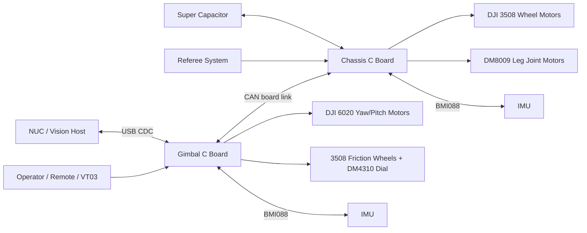
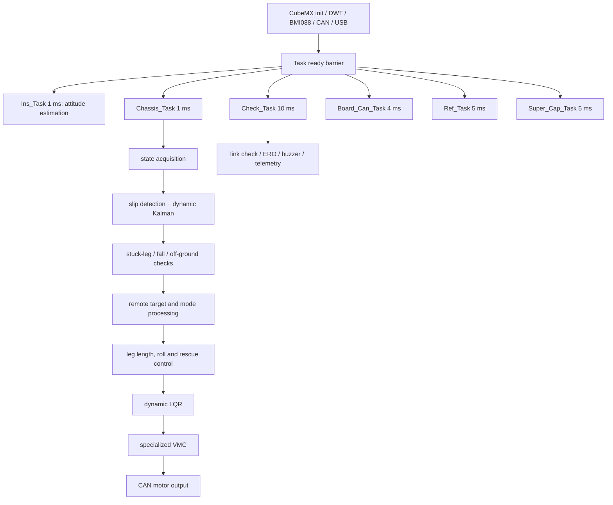
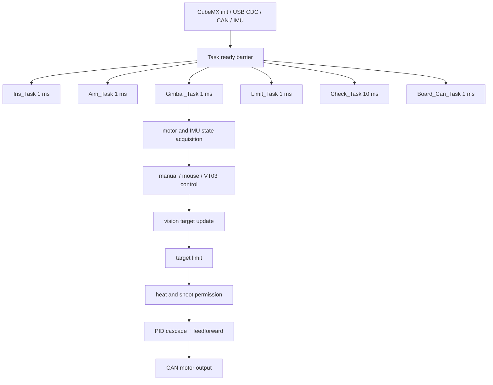

# RoboMaster Wheel-Leg Embedded Control 2026

中文 | [English](#english)

## 项目简介

本仓库是面向 RoboMaster 2026 赛季轮腿英雄/步兵与云台系统的 STM32 嵌入式控制工程。工程包含两个独立的控制板项目：

- `Chassis`: 偏置并联轮腿底盘控制。核心包括 FreeRTOS 任务框架、五连杆/偏置并联腿运动学、特化 VMC、动态 LQR、速度融合、打滑检测、卡腿保护、离地检测、倒地自救、超级电容与裁判系统通信。
- `Gimbal`: 云台与发射机构控制。核心包括双环云台控制、Pitch 重心补偿、摩擦轮加速度/转速差前馈、拨盘控制、热量约束、上位机 USB CDC 通信、板间 CAN 通信与遥控链路管理。

当前 README 结合仓库源码、队内历史测试记录与公开技术资料整理而成，用于说明工程结构、实机表现和关键算法思路。

## 主要功能

- 双 C 板协同: 底盘板与云台板通过 CAN 交换遥控、裁判、弹仓、云台姿态、底盘状态和故障信息。
- 多任务实时控制: 基于 STM32CubeMX 生成 FreeRTOS/CMSIS-RTOS V1 任务，IMU 与主控任务以 1 ms 周期运转，状态检测、板间通信、裁判系统和超级电容任务按不同周期分层执行。
- 偏置并联腿控制: 将腿长力 `F0` 和腿杆力矩 `Tp` 通过 VMC 映射到双关节电机输出，并保留传统五连杆 VMC 作为对比。
- 动态 LQR: 基于左右腿长拟合增益矩阵，并在小陀螺、离地、卡腿等工况下调整有效状态和增益权重。
- 速度融合与打滑检测: 通过轮速、IMU 加速度、车体估计速度和偏航角速度构造多条件打滑判据，并在打滑时动态调整卡尔曼滤波 `Q/R` 权重。
- 安全保护: 支持电机离线检测、遥控/图传链路检测、倒地自救、离地控制、卡腿降输出、磕台阶模式和 ERO 故障停机。
- 云台与发射控制: 云台采用位置环/速度环串级 PID 与前馈补偿；摩擦轮通过转速闭环、加速度前馈和左右转速差前馈提升弹速稳定性。

## 实际效果

队内历史测试记录中的实机指标如下，可作为阶段性运行效果参考：

- 轮腿英雄空载约 29.0 kg，低腿长最高行进速度约 2.3 m/s。
- 小陀螺最大转速约 11 rad/s。
- 腿杆最大伸展长度约 0.37 m。
- 空载可稳定跳跃约 0.25 m，极限跳跃高度约 0.35 m。
- 70 W 功率限制下，0.25 m 腿长可稳定通过约 17 度飞坡，可稳定驻停在 20 度及以下坡面，最大跨越约 26 度坡面。
- 云台/发射机构标准弹速约 22.5 m/s，连续发射误差在材料中记录为约 +/-0.4 m/s；摩擦轮优化场景中部分测试可达约 +/-0.3 m/s。

## 目录结构

```text
.
├── Chassis/                  底盘 C 板工程
│   ├── APP/                  通用应用模块: 遥控、CAN反馈、VMC、上位机调试等
│   ├── Bsp/                  板级支持: CAN、DWT、PWM、蜂鸣器、遥控底层
│   ├── Controller/           PID 与 LQR 控制器
│   ├── External_Device/      BMI088 IMU 驱动
│   ├── Judge/                裁判系统协议与 CRC/FIFO
│   ├── Math/                 卡尔曼滤波、四元数 EKF、数学工具
│   ├── Motor/                DJI/达妙电机协议与控制
│   ├── Parameter_Tree/       底盘机械、阈值与模式参数
│   ├── Task/                 FreeRTOS 用户任务
│   ├── Src/ Inc/             CubeMX 生成的外设与启动代码
│   └── MDK-ARM/              Keil 工程文件
├── Gimbal/                   云台 C 板工程
│   ├── APP/ Bsp/ Controller/ 与底盘类似的应用、底层与 PID 模块
│   ├── External_Device/      BMI088 IMU 驱动
│   ├── Judge/ Math/ Motor/   裁判、数学、电机模块
│   ├── Task/                 Aim、Gimbal、Limit、Check、Board CAN 等任务
│   ├── Src/ Inc/             CubeMX 生成代码
│   └── MDK-ARM/              Keil 工程文件
├── docs/                     说明文档输出目录
├── LICENSE                   原创代码与文档的 MIT 许可
├── NOTICE.md                 第三方组件许可说明
└── README.md                 中英文使用说明
```

## 开发环境

- MCU: STM32F407IGHx，Arm Cortex-M4F，主频 168 MHz。
- 工具链: STM32CubeMX / STM32CubeIDE 生成工程配置，Keil MDK-ARM V5.32 打开与编译 `*.uvprojx`。
- 固件包: STM32Cube FW_F4 V1.28.3。
- RTOS: FreeRTOS，CMSIS-RTOS V1 接口。
- 通信: CAN1/CAN2 1 Mbps，USB Device CDC FS，USART1/3/6，SPI1，I2C3。
- 关键硬件: DJI C 板、BMI088、DJI 3508、DJI 6020、达妙 DM8009/DM4310、超级电容、裁判系统、图传/VT03/DT7 遥控链路。

## 系统框架



## 软件框架

### Chassis 任务链路



### Gimbal 任务链路



## 快速使用

1. 安装 Keil MDK-ARM V5.32 或兼容版本，并安装 STM32F4 设备支持包。
2. 安装 STM32CubeMX/STM32CubeIDE，用于查看或重新生成 `Cboard.ioc` 外设配置。
3. 分别打开 `Chassis/MDK-ARM/Cboard.uvprojx` 与 `Gimbal/MDK-ARM/Cboard.uvprojx`。
4. 检查目标芯片是否为 `STM32F407IGHx`，确认包含路径、启动文件和 FPU 配置未丢失。
5. 按实际机器人硬件修改参数:
   - 底盘机械和阈值: `Chassis/Parameter_Tree/Parameter.h`
   - 底盘 LQR/VMC: `Chassis/Controller/Src/LQR.c`, `Chassis/APP/Src/VMC.c`
   - 云台与发射参数: `Gimbal/Task/Inc/Gimbal_Task.h`, `Gimbal/Task/Src/Gimbal_Task.c`
6. 编译后分别下载到底盘 C 板和云台 C 板。
7. 上电前确认 CAN ID、电机方向、机械零点、限位、超级电容、裁判系统、遥控器和急停策略。
8. 首次调试建议架空测试电机方向，再低功率落地测试，最后进行动态、跳跃、坡面和对抗工况测试。

## 关键参数入口

- 机械参数: `M_car`, `R_wheel`, `L_wheel`, `Gear_Ratio`, `UP/MID/DOWN_LEG_LENGTH`。
- 速度上限: `DX_*_MAX`, `DYAW_*_MAX`。
- 打滑阈值: `LRW_THRESHOLD`, `DVB_THRESHOLD`, `DBY_THRESHOLD`, `DVW_THRESHOLD`。
- 卡腿阈值: `BST_THRESHOLD`, `BRING_TWHEEL_MAX`, `BRING_LEG_THETA_MAX`。
- LQR 增益拟合: `P[40][6]` 与 `Fitting_K_Calc()`。
- 云台限幅: `PITCH_UP_LIMIT_POSITION`, `PITCH_DOWN_LIMIT_POSITION`。
- 摩擦轮目标转速: `Friction_Speed` 与 `Friction_Speed_Comp`。

## 移植说明

- 同系列 STM32F4: 优先复制 `Cboard.ioc`，重新分配 CAN、USB、USART、SPI、I2C、TIM 和 DMA，再保持任务周期与中断优先级一致。
- 不同 STM32 系列: 需要重新生成 HAL、启动文件、时钟树和 FreeRTOS 配置，并复核 FPU、DWT、USB CDC、CAN/FDCAN 差异。
- 不同电机或减速箱: 更新 `Kt`、`Gear_Ratio`、电机协议解析、CAN ID、力矩到电流的换算关系。
- 不同腿机构: 重新推导 `Leg_Calc()`、`VMC_Calc()`、逆运动学和 LQR 状态模型，不能直接套用当前几何参数。
- 不同机器人质量/弹仓/云台布置: 需要重采样并重新拟合质心补偿与 Pitch 补偿。

## 技术理论与参考资料

- STM32F407 官方资料: https://www.st.com/en/microcontrollers-microprocessors/stm32f407ig.html
- STM32CubeIDE 官方资料: https://www.st.com/en/development-tools/stm32cubeide.html
- Arm CMSIS: https://arm-software.github.io/CMSIS_6/latest/General/index.html
- FreeRTOS Kernel: https://github.com/FreeRTOS/FreeRTOS-Kernel
- Kalman, R. E. "A New Approach to Linear Filtering and Prediction Problems", 1960: https://www.cs.unc.edu/~welch/kalman/kalmanPaper.html
- MIT Underactuated Robotics, LQR chapter: https://underactuated.mit.edu/lqr.html
- Wheeled inverted pendulum trajectory/control reference: https://arxiv.org/abs/1811.12819
- RoboMaster research platform reference: https://arxiv.org/abs/2405.02198

## 未来优化方向

- 将离线拟合参数、阈值和机器人结构参数迁移到统一配置表，减少硬编码。
- 增加上位机自动记录与回放工具，沉淀打滑、卡腿、飞坡、跳跃、弹速等测试数据。
- 完整补齐无人机云台 Yaw 电控软限位逻辑，并将限位状态接入遥控/自瞄目标管理。
- 为 PID、滤波、VMC、LQR 矩阵计算增加桌面端单元测试和仿真验证。
- 建立 Doxygen 文档、代码格式规范和 CI 检查，提升多人协作质量。
- 进一步研究 MPC/RL 与 LQR/VMC 的结合方式，在保证 STM32 实时性的前提下提升复杂地形自适应能力。

## 许可证

原创工程代码与文档采用 MIT License。第三方组件保留其原始许可，详见 `NOTICE.md` 以及各第三方目录中的 `LICENSE` 文件。特别注意: ST USB Device Library 等 ST 组件包含面向 ST 微控制器的使用限制。

---

# English

## Overview

This repository contains the STM32 embedded-control projects for a RoboMaster 2026 wheel-legged robot and its gimbal/shooter system. It is organized as two independent C-board firmware projects:

- `Chassis`: wheel-leg chassis control, including FreeRTOS tasks, offset parallel-leg kinematics, specialized VMC, dynamic LQR, velocity fusion, slip detection, stuck-leg protection, off-ground detection, self-rescue, super capacitor communication, and referee-system communication.
- `Gimbal`: gimbal and shooter control, including cascaded gimbal PID, pitch gravity compensation, friction-wheel acceleration/feedforward control, dial control, heat limiting, USB CDC vision-host communication, board-to-board CAN, and remote-link management.

This README is compiled from the repository source code, internal historical test records, and public technical references.

## Features

- Dual-board architecture: the chassis and gimbal C boards exchange remote, referee, ammunition, gimbal, chassis, and fault states through CAN.
- Real-time FreeRTOS scheduling: IMU and primary control tasks run at 1 ms; safety, board CAN, referee, and super capacitor tasks run at lower but deterministic rates.
- Offset wheel-leg control: virtual leg force `F0` and leg torque `Tp` are mapped to joint-motor torques through VMC.
- Dynamic LQR: gain matrices are fitted from left/right leg length and adapted for spinning, off-ground, and stuck-leg states.
- Slip-aware velocity fusion: wheel speed, IMU acceleration, estimated body velocity, and yaw-rate deviation are used to detect slip and switch Kalman `Q/R` weights.
- Safety handling: motor/link loss detection, remote loss handling, fall recovery, off-ground control, stuck-leg current limiting, step-bump mode, and ERO emergency stop.
- Gimbal and shooter control: cascaded PID plus feedforward for yaw/pitch, and acceleration/speed-difference feedforward for the friction wheels.

## Field Results

Internal historical tests record the following field results:

- Empty vehicle mass around 29.0 kg.
- Maximum low-leg driving speed around 2.3 m/s.
- Maximum spin speed around 11 rad/s.
- Maximum leg extension around 0.37 m.
- Stable empty jump height around 0.25 m, with an extreme jump around 0.35 m.
- Under a 70 W power limit and 0.25 m leg length, stable traversal of a 17-degree ramp, stable stop on slopes up to about 20 degrees, and maximum slope traversal around 26 degrees.
- Gimbal/shooter standard projectile speed around 22.5 m/s; recorded error around +/-0.4 m/s, with some optimized friction-wheel tests around +/-0.3 m/s.

## Repository Layout

```text
.
├── Chassis/                  Chassis C-board project
│   ├── APP/                  App modules: RC, CAN feedback, VMC, telemetry
│   ├── Bsp/                  Board support: CAN, DWT, PWM, buzzer, RC
│   ├── Controller/           PID and LQR controllers
│   ├── External_Device/      BMI088 driver
│   ├── Judge/                Referee protocol, CRC, FIFO
│   ├── Math/                 Kalman filter, Quaternion EKF, math helpers
│   ├── Motor/                DJI and Damiao motor protocols
│   ├── Parameter_Tree/       Mechanical parameters and thresholds
│   ├── Task/                 FreeRTOS user tasks
│   ├── Src/ Inc/             CubeMX-generated peripheral code
│   └── MDK-ARM/              Keil project files
├── Gimbal/                   Gimbal C-board project
├── docs/                     Documentation output
├── LICENSE                   MIT license for original project code/docs
├── NOTICE.md                 Third-party license notes
└── README.md                 Bilingual project guide
```

## Development Environment

- MCU: STM32F407IGHx, Arm Cortex-M4F, 168 MHz.
- Toolchain: STM32CubeMX / STM32CubeIDE for configuration, Keil MDK-ARM V5.32 for `*.uvprojx` build and download.
- Firmware package: STM32Cube FW_F4 V1.28.3.
- RTOS: FreeRTOS through CMSIS-RTOS V1.
- Communication: CAN1/CAN2 at 1 Mbps, USB Device CDC FS, USART1/3/6, SPI1, I2C3.
- Hardware: DJI C board, BMI088, DJI 3508, DJI 6020, Damiao DM8009/DM4310, super capacitor, referee system, VT03/DT7 remote links.

## Usage

1. Install Keil MDK-ARM V5.32 or a compatible version with STM32F4 device support.
2. Install STM32CubeMX/STM32CubeIDE if you need to inspect or regenerate `Cboard.ioc`.
3. Open `Chassis/MDK-ARM/Cboard.uvprojx` and `Gimbal/MDK-ARM/Cboard.uvprojx`.
4. Confirm the target device is `STM32F407IGHx`.
5. Tune project parameters for your robot:
   - Chassis mechanics and thresholds: `Chassis/Parameter_Tree/Parameter.h`
   - Chassis LQR/VMC: `Chassis/Controller/Src/LQR.c`, `Chassis/APP/Src/VMC.c`
   - Gimbal/shooter: `Gimbal/Task/Inc/Gimbal_Task.h`, `Gimbal/Task/Src/Gimbal_Task.c`
6. Build and flash the chassis and gimbal C boards separately.
7. Before power-on tests, verify CAN IDs, motor directions, mechanical zero points, limit protection, super capacitor, referee system, remote link, and emergency stop behavior.
8. Start with lifted-wheel motor tests, then low-power ground tests, and finally dynamic jump, slope, slip, and collision scenarios.

## Portability

- STM32F4-to-STM32F4: reuse `Cboard.ioc`, remap peripherals, and preserve task periods plus NVIC priorities.
- Different STM32 family: regenerate HAL, startup files, clocks, FreeRTOS config, USB, and CAN/FDCAN layers.
- Different motors or gearboxes: update torque constants, gear ratio, motor protocol, CAN IDs, and current-to-torque conversion.
- Different leg mechanism: rederive kinematics, VMC, inverse kinematics, and LQR state model.
- Different mass distribution: resample and refit body, gimbal, ammunition, and pitch compensation terms.

## References

- STM32F407 official product page: https://www.st.com/en/microcontrollers-microprocessors/stm32f407ig.html
- STM32CubeIDE: https://www.st.com/en/development-tools/stm32cubeide.html
- Arm CMSIS: https://arm-software.github.io/CMSIS_6/latest/General/index.html
- FreeRTOS Kernel: https://github.com/FreeRTOS/FreeRTOS-Kernel
- Kalman filter original paper: https://www.cs.unc.edu/~welch/kalman/kalmanPaper.html
- MIT Underactuated Robotics, LQR: https://underactuated.mit.edu/lqr.html
- Wheeled inverted pendulum reference: https://arxiv.org/abs/1811.12819
- RoboMaster research platform reference: https://arxiv.org/abs/2405.02198

## License

Original project code and documentation are released under the MIT License. Third-party vendor and middleware components retain their original licenses. See `NOTICE.md` and the license files inside each third-party directory.
